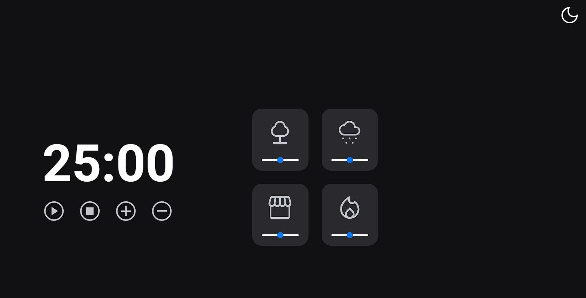

<h1 align="center"> Focus Timer - 2.0</h1>

Projeto desenvolvido no modulo 5 do Explorer da Rocketseat, utilizando aplicação que alterna entre Dark e Light Mode de um Temporizador no estilo Pomodoro para ajudar a manter a concetração.
.  

  

  

 <h2 align="center"><a href="https://kaiquerebonato.github.io/Focus-Timer-Desafio/" target="_blank">Projeto ao vivo</a></h2>

### 🚀 Tecnologias

Esse projeto foi desenvolvido com as seguintes tecnologias:

- HTML e CSS
- Javascript
- Git e Github
- Figma

### :memo: Licença

Esse projeto está sob a licença MIT.

---

Feito com ♥ por Kaique Rebonato :wave: